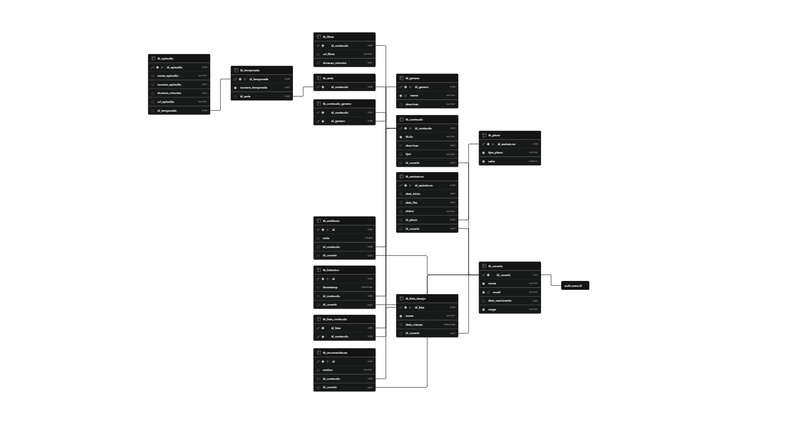

# 🎬 Projeto BadPlay - Banco de Dados 2

Repositório destinado à disciplina de Banco de Dados 2. O **BadPlay** é uma plataforma de streaming de conteúdos audiovisuais (Filmes e Séries) com controle de assinaturas, avaliações, histórico de visualizações e listas de desejo.

**Equipe:** Arthur Henrique Firmino de Souza, Jose Arthur de Araujo Almeida, Mateus Miranda da Silva e Ruan Gouveia dos Santos.

---

## 🗺️ Modelagem de Dados

Para chegar à estrutura ideal do banco de dados, passamos por três fases de modelagem:

### 1. Modelo Conceitual
*(Planejamento das regras de negócio e relacionamentos)*

### 2. Modelo Relacional (Lógico)
*(Estruturação inicial das tabelas e chaves primárias/estrangeiras)*

### 3. Modelo Físico Oficial (Supabase)
*(Implementação real no PostgreSQL, evidenciando a herança, a unificação do Cargo (Role) na tabela de Usuário e a forte integração com o provedor de identidade `auth.users` via UUID para aplicação do Row Level Security).*

---

## 🛡️ Dicionário de Dados e Segurança (Row Level Security)

O banco de dados foi implementado no **Supabase** (PostgreSQL). Utilizamos integração direta com o provedor de identidade (`auth.users`) vinculando o `id_usuario` via UUID. Abaixo está o detalhamento automático das tabelas e das políticas restritivas de RLS (Row Level Security) criadas para o negócio.

### 🗄️ Tabelas

#### `tb_usuario`
| Name | Type | Constraints |
|------|------|-------------|
| `id_usuario` | `uuid` | Primary Key, FK (auth.users) |
| `nome` | `varchar` | Not Null |
| `email` | `varchar` | Not Null, Unique |
| `data_nascimento` | `date` | Nullable |
| `cargo` | `varchar` | Default 'CLIENTE', Check (CLIENTE/ADMIN) |

#### `tb_conteudo` (Herança Pai)
| Name | Type | Constraints |
|------|------|-------------|
| `id_conteudo` | `int8` | Primary Identity |
| `titulo` | `varchar` | Not Null |
| `descricao` | `text` | Nullable |
| `tipo` | `varchar` | Nullable |
| `id_usuario` | `uuid` | FK (Admin Criador) |

#### `tb_filme` (Herança Filha)
| Name | Type | Constraints |
|------|------|-------------|
| `id_conteudo` | `int8` | Primary, FK (tb_conteudo) |
| `url_filme` | `varchar` | Nullable |
| `duracao_minutos` | `int4` | Nullable |

#### `tb_serie` (Herança Filha)
| Name | Type | Constraints |
|------|------|-------------|
| `id_conteudo` | `int8` | Primary, FK (tb_conteudo) |

#### `tb_temporada`
| Name | Type | Constraints |
|------|------|-------------|
| `id_temporada` | `int8` | Primary Identity |
| `numero_temporada` | `int4` | Not Null |
| `id_serie` | `int8` | FK (tb_serie) |

#### `tb_episodio`
| Name | Type | Constraints |
|------|------|-------------|
| `id_episodio` | `int8` | Primary Identity |
| `nome_episodio` | `varchar` | Nullable |
| `numero_episodio` | `int4` | Nullable |
| `duracao_minutos` | `int4` | Nullable |
| `url_episodio` | `varchar` | Nullable |
| `id_temporada` | `int8` | FK (tb_temporada) |

#### `tb_genero`
| Name | Type | Constraints |
|------|------|-------------|
| `id_genero` | `int8` | Primary Identity |
| `nome` | `varchar` | Not Null, Unique |
| `descricao` | `varchar` | Nullable |

#### `tb_plano`
| Name | Type | Constraints |
|------|------|-------------|
| `id_assinatura` | `int8` | Primary Identity |
| `tipo_plano` | `varchar` | Check (BASICO, PADRAO, PREMIUM) |
| `valor` | `numeric` | Not Null |

#### `tb_assinatura`
| Name | Type | Constraints |
|------|------|-------------|
| `id_assinatura` | `int8` | Primary Identity |
| `data_inicio` | `date` | Nullable |
| `data_fim` | `date` | Nullable |
| `status` | `varchar` | Nullable |
| `id_plano` | `int8` | FK (tb_plano) |
| `id_usuario` | `uuid` | FK (tb_usuario) |

#### Tabelas de Relacionamento e Interação Privada
*   **`tb_conteudo_genero`**: (id_conteudo, id_genero)
*   **`tb_lista_desejo`**: (id_lista, nome, data_criacao, id_usuario)
*   **`tb_lista_conteudo`**: (id_lista, id_conteudo)
*   **`tb_historico`**: (id, timestamp, id_conteudo, id_usuario)
*   **`tb_avaliacao`**: (id, nota, id_conteudo, id_usuario)
*   **`tb_recomendacao`**: (id, motivo, id_conteudo, id_usuario)

---

### 🔐 RLS Policies (Regras de Negócio e Controle de Acesso)

As políticas garantem Arquitetura de Defesa em Profundidade. O catálogo é de **Leitura Pública**, mas de **Escrita Exclusiva para Admins (RBAC)**. Interações de usuários (Histórico, Listas e Assinaturas) possuem **Isolamento Total**, e o acesso ao conteúdo do histórico é bloqueado via banco de dados caso a assinatura do usuário não esteja ativa (`WITH CHECK`).

| Tabela | Policy | Roles | Action | USING | WITH CHECK |
|--------|--------|-------|--------|-------|------------|
| **tb_usuario** | `Privacidade de Perfil` | authenticated | ALL | `(id_usuario = auth.uid())` | — |
| **tb_conteudo** | `Leitura Publica Conteudos` | anon, authenticated | SELECT | `true` | — |
| **tb_conteudo** | `Admin Modifica Catalogo` | authenticated | ALL | `(EXISTS (SELECT 1 FROM tb_usuario WHERE (id_usuario = auth.uid()) AND (cargo = 'ADMIN')))` | — |
| **tb_filme** | `Leitura Publica Filmes` | anon, authenticated | SELECT | `true` | — |
| **tb_filme** | `Admin Modifica Filmes` | authenticated | ALL | `(EXISTS (SELECT 1 FROM tb_usuario WHERE (id_usuario = auth.uid()) AND (cargo = 'ADMIN')))` | — |
| **tb_serie** | `Leitura Publica Series` | anon, authenticated | SELECT | `true` | — |
| **tb_serie** | `Admin Modifica Series` | authenticated | ALL | `(EXISTS (SELECT 1 FROM tb_usuario WHERE (id_usuario = auth.uid()) AND (cargo = 'ADMIN')))` | — |
| **tb_episodio** | `Admin Modifica Episodios` | authenticated | ALL | `(EXISTS (SELECT 1 FROM tb_usuario WHERE (id_usuario = auth.uid()) AND (cargo = 'ADMIN')))` | — |
| **tb_assinatura** | `Isolamento Assinatura` | authenticated | ALL | `(id_usuario = auth.uid())` | — |
| **tb_avaliacao** | `Leitura Publica Avaliacoes` | anon, authenticated | SELECT | `true` | — |
| **tb_avaliacao** | `Escrita Privada Avaliacoes` | authenticated | ALL | `(id_usuario = auth.uid())` | — |
| **tb_lista_desejo**| `Isolamento Lista` | authenticated | ALL | `(id_usuario = auth.uid())` | — |
| **tb_lista_conteudo**| `Isolamento Conteudo da Lista` | authenticated | ALL | `(EXISTS (SELECT 1 FROM tb_lista_desejo l WHERE (l.id_lista = tb_lista_conteudo.id_lista) AND (l.id_usuario = auth.uid())))` | — |
| **tb_historico** | `Leitura do Historico` | authenticated | SELECT | `(id_usuario = auth.uid())` | — |
| **tb_historico** | `Delecao do Historico` | authenticated | DELETE | `(id_usuario = auth.uid())` | — |
| **tb_historico** | `Assinante Ativo Assiste` | authenticated | INSERT | — | `((id_usuario = auth.uid()) AND (EXISTS (SELECT 1 FROM tb_assinatura a WHERE (a.id_usuario = auth.uid()) AND (a.status = 'ATIVA') AND (a.data_fim >= CURRENT_DATE))))` |
